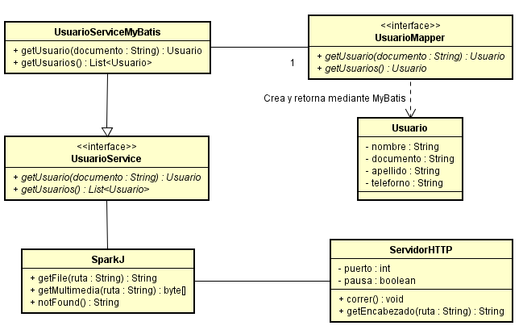

# MiniSpark #

## Prerrequisitos ##

La persona que quiera utilizar este programa debe tener conocimientos básicos en Java, Maven y debe contar con conocimientos sobre el protocolo HTTP. 
Para compilar y ejecutar el programa localmente debe tener: 

- Java 8

- Maven 3.6.3

## Herramientas utilizadas para el desarrollo ##

Para el desarrollo de este programa se utilizó: 

- Java: Fue el lenguaje de programación utilizado para el desarrollo.

- Maven: Fue la herramienta utilizada para la gestión y construcción del programa.

- Heroku: Fue la herramienta que se utilizó para el despliegue de la aplicación. 

- CircleCi: Fue la herramienta que se utilizó para la integración continua.


## Descripción ## 

Este programa fue diseñado como un prototipo de una implementación de un servidor web en java utilizando únicamente las liberías por defecto. En nuestro programa, creamos un servior capaz de retornar archivos: html, jpg, png, js, css y json. Para probar el correcto funcionamiento del servidor, montamos una pequeña app (puede ser accedida en la página web "index.html") que trae información de unos usuarios (información almacenada en una base de datos Postgres) y la muestra en pantalla.

## Modelo ##


Se implementó una clase denominada "ServidorHTTP", la cual es la encargada de recibir y enviar mensajes HTTP. La clase "SparkJ" es la que se encarga de buscar los recursos solicitados y retornarlos (siempre y cuando estos existan). La interfaz "UsuarioService" es la que define los métodos necesarios para acceder a los datos de los usuario, mientras que la clase "UsuarioServiceMyBatis" implementa estos métodos accediendo a la base de datos Postgres (esta también esta en los servidores de Heroku) mediante el uso de MyBatis. Debido a que usamos MyBatis para acceder a los datos, fue necesario implementar un Pojo llamado "Usuario", que nos permite transoformar la información de una fila de una tabla, en un objeto de Java.

## Instrucciones para su compilación, ejecución y generación de documentación ##

Para compilar el programa, se debe primero ubicar en la carpeta del archivo y posteriormente ejecutar el siguiente comando: 

```
   mvn package 
```

Una vez compilado el programa, lo siguiente es ejecutarlo. Para esto, otra vez ubicado en la carpeta del programa, ejecute el siguiete comando:

```
   mvn exec:java -Dexec.mainClass="edu.eci.arep.Main" 
```
El programa, por defecto, usa el puerto 36000. Así que asegurese de tenerlo disponible, o de no ser posible, cambiar este puerto por otro (esta acción puede realizarse en la clase Main)

Si desea generar una nueva documentación del programa, debe ejecutar la siguiente lista de comandos:

```
   mvn javadoc:javadoc
   mvn javadoc:jar
   mvn javadoc:aggregate
   mvn javadoc:aggregate-jar
   mvn javadoc:test-javadoc
   mvn javadoc:test-jar
   mvn javadoc:test-aggregate
   mvn javadoc:test-aggregate-jar
```

Vale recalcar que el programa ya cuenta con archivos de documentación ubicados en la carpeta "Documentacion".

## Licencia ## 

La licencia de este proyecto es: [**GNU General Public License v3.0**](LICENSE)

## Autor ##

Julián David Gutiérrez Vanegas
